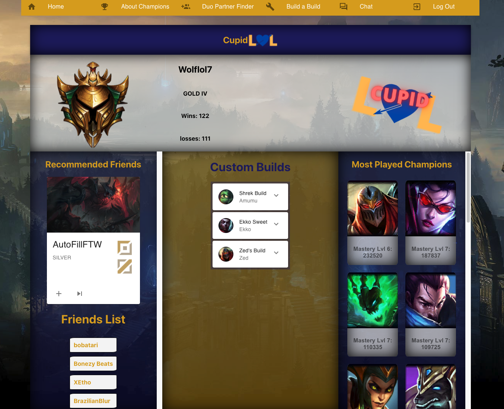

# Cupid Lol

GitHub Repo: [https://github.com/jbryant4/duoLOL]  

Deployed at: [https://duolol.herokuapp.com/](https://duolol.herokuapp.com/)  

 

## Description

A fully functioning Google Books API search engine built with a RESTful API, and refactored to be a GraphQL API built with Apollo Server. The app was built using the MERN stack, with a React front end, MongoDB database, and Node.js/Express.js server and API.

# Table of Contents

- [Technologies](#Technologies)
- [Installation](#Installation)
- [Usage](#usage)
- [Contributions](#Contributions)
- [Contact](#Contact)
- [License](#license)

## Technologies

This project was built using HTML, CSS, Javascript, as well as:

- React
- Socket.io
- GraphQL
- RIOT API
- Node.JS
- NoSQL
- Express
- MongoDB
- MongoDB Atlas
- React Webpack
- Material UI framework
- JWT

## Installation

- Clone the repo:

  use: `git clone https://github.com/jbryant4/duoLOL.git` in the command line

- Install npm required dependencies by running (`npm run install`) in the command line.

- This script will Install required npm packages into Client and Server directories by running the concurrent script `"install": "cd server && npm i && cd ../client && npm i"`

## Usage

- Visit deployed website to be taken to the homepage.
- Click on Login/Sign up in the navigation bar to get started
- Search for books to add to your saved searches
- View your Saved Searches and Delete from your Saved Searches link

## Contributions

Developed by:
Joseph Bryant - Github Profile: (https://github.com/jbryant4)
Robert Schwartz - Github Profile: (https://github.com/Robert-Schwartz)
Cody Hebert - Github Profile: (https://github.com/CdHebert)
Nathan da Silva - Github Profile: (https://github.com/PacSmack)

## License

NPM MIT RIOT

- We do not speak for or represent RIOT inc
